---
## Front matter
lang: ru-RU
title: Лабораторная работа №1
subtitle: Установка и конфигурация операционной системы на виртуальную машину
author:
  - Акунаева Антонина Эрдниевна
institute:
  - Российский университет дружбы народов, Москва, Россия
  
date: 2025-02-21

## i18n babel
babel-lang: russian
babel-otherlangs: english

## Formatting pdf
toc: false
toc-title: Содержание
slide_level: 2
aspectratio: 169
section-titles: true
theme: metropolis
header-includes:
 - \metroset{progressbar=frametitle,sectionpage=progressbar,numbering=fraction}
---

# Информация

## Докладчик

:::::::::::::: {.columns align=center}
::: {.column width="70%"}

  * Акунаева Антонина Эрдниевна
  * студент ФФМиЕН, НПИбд-01-24
  * Российский университет дружбы народов
  * [1032240492@rudn.ru](mailto:1032240492@rudn.ru)
  * <https://github.com/axelxi>

:::
::: {.column width="30%"}


:::
::::::::::::::

# Цели и задачи

- Целью данной работы является приобретение практических навыков установки операционной системы на виртуальную машину, настройки минимально необходимых для дальнейшей работы сервисов.

1. Установить дистрибутив Rocky 10.1 на виртуальную машину.

# Материалы и методы

- Linux (дистрибутив Rocky 10.1)
- Oracle VirtualBox

# Выполнение лабораторной работы

## Создание виртуальной машины

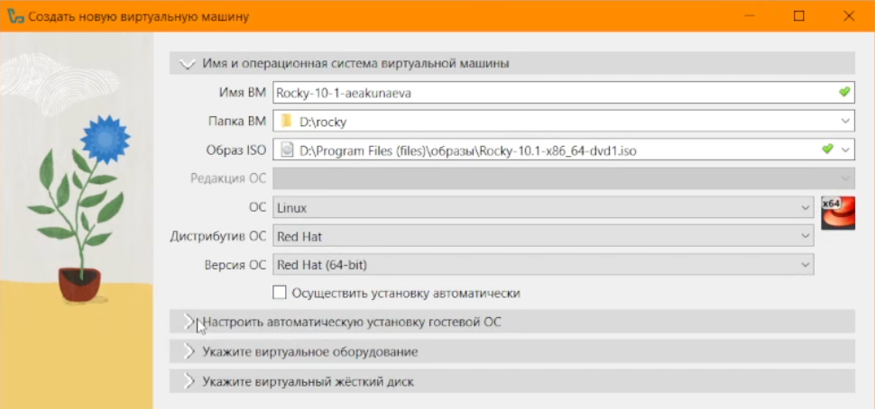{#fig:001 width=65%}

## Задание параметров ОС

{#fig:002 width=65%}

## Создание виртуального жёсткого диска

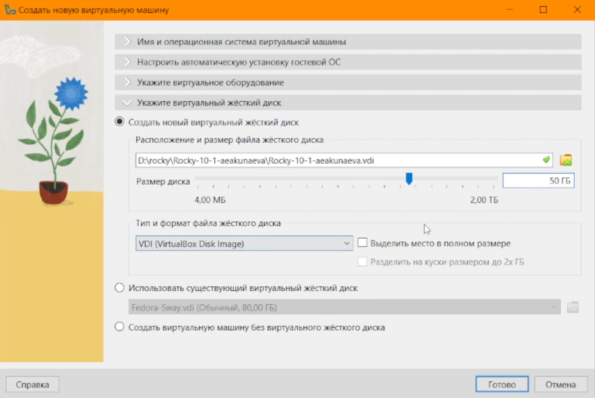{#fig:003 width=65%}

## Установка основного языка системы

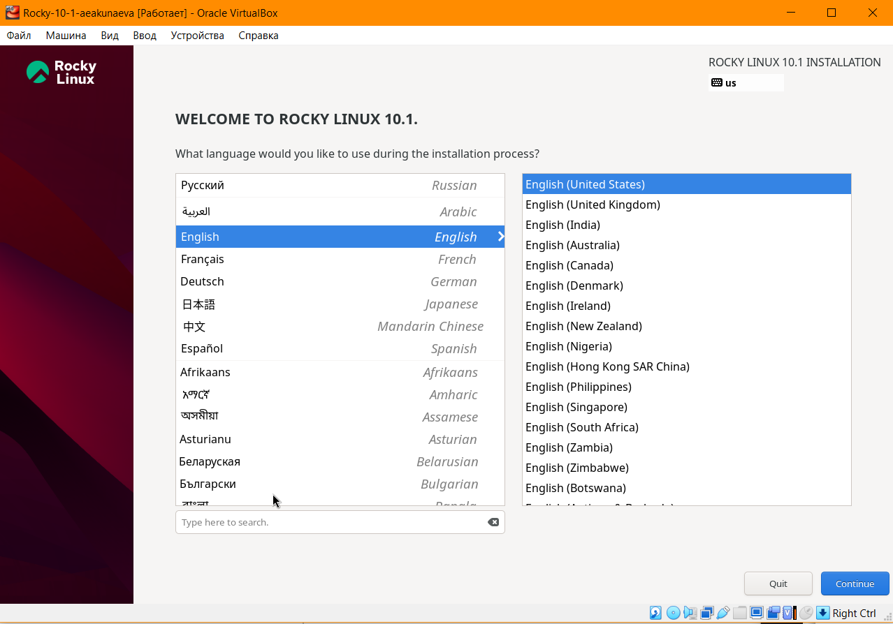{#fig:004 width=65%}

## Секция Software Selection

{#fig:005 width=65%}

## Секция Network & Host Name

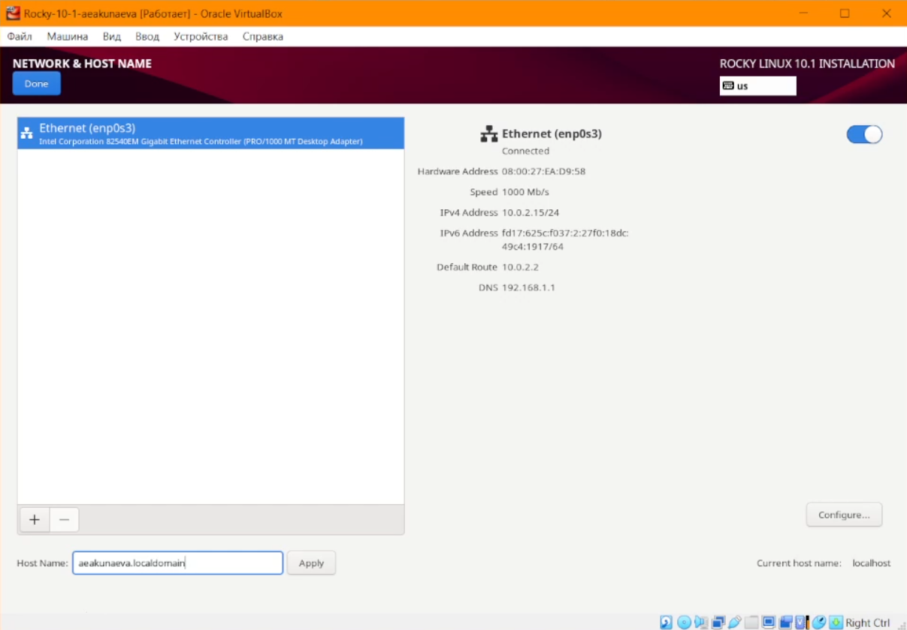{#fig:006 width=65%}

## Секция Create User/Root Account

{#fig:007 width=65%}

## Общие настройки системы

{#fig:008 width=65%}

## Установка ОС

{#fig:009 width=65%}

## Подключение образа Дополнений гостевой ОС

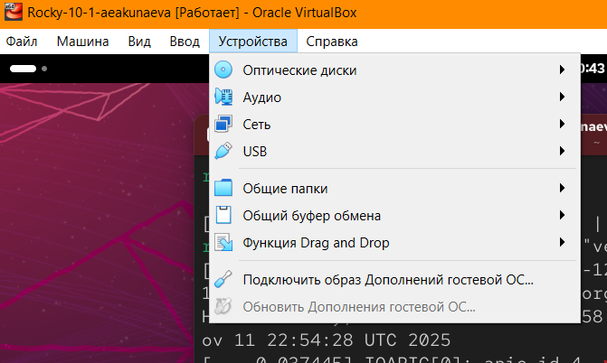{#fig:010 width=65%}

## Домашнее задание: dmesg | less

```
dmesg | less
```

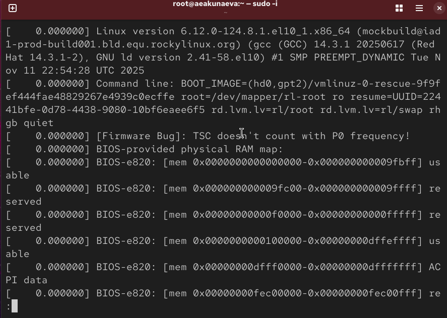{#fig:011 width=65%}

## Домашнее задание №1

```
dmesg | grep -i "version"
```

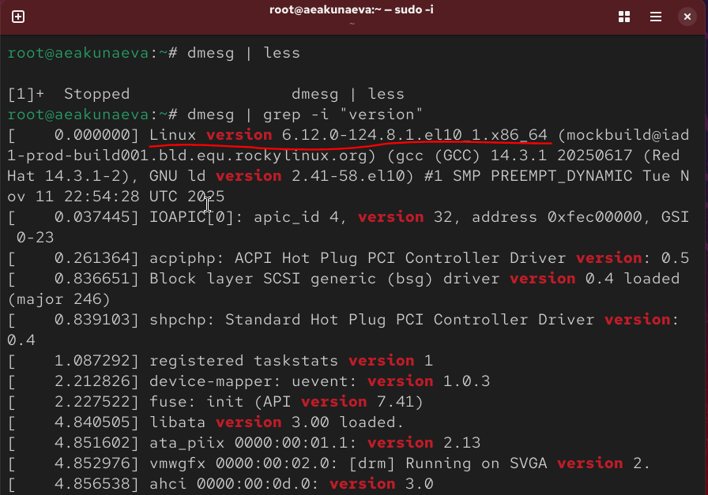{#fig:012 width=65%}

## Домашнее задание №2-3

```
dmesg | grep -i "processor"
```

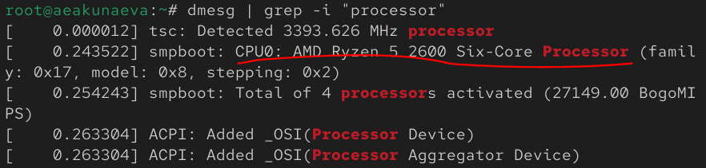{#fig:013 width=65%}

## Домашнее задание №4.1

```
dmesg | grep -i "memory"
```

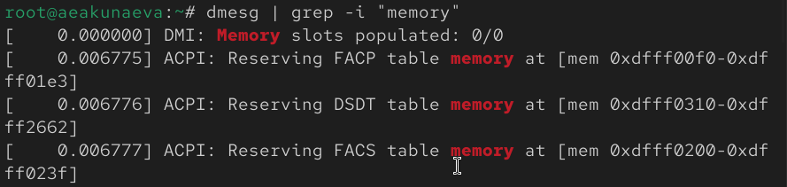{#fig:014 width=65%}

## Домашнее задание №4.2

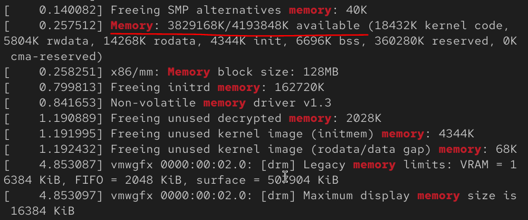{#fig:015 width=65%}

## Домашнее задание №5

```
dmesg | grep -i "hypervisor"
```

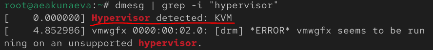{#fig:016 width=65%}

## Домашнее задание №6-7

```
dmesg | grep -i "filesystem"
```

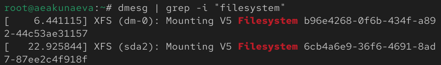{#fig:017 width=65%}

# Выводы

Я приобрела практические навыки установки операционной системы на виртуальную машину, настройки минимально необходимых для дальнейшей работы сервисов.
