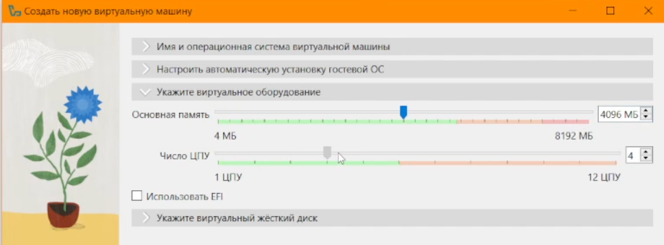
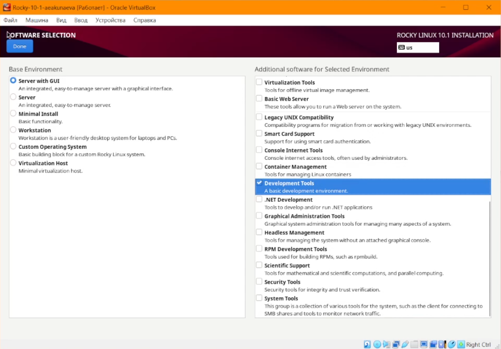
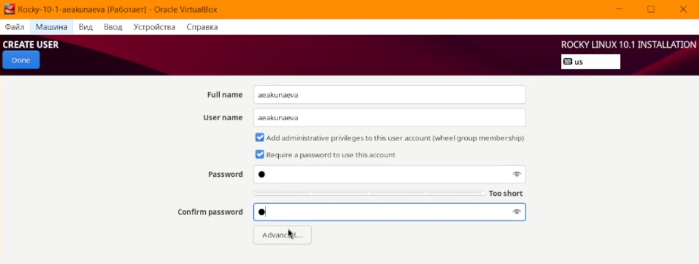
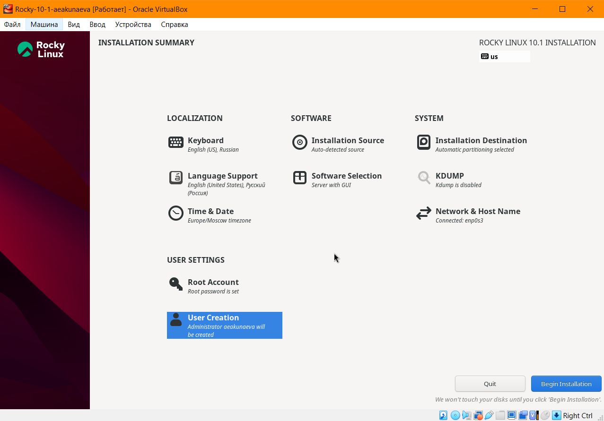
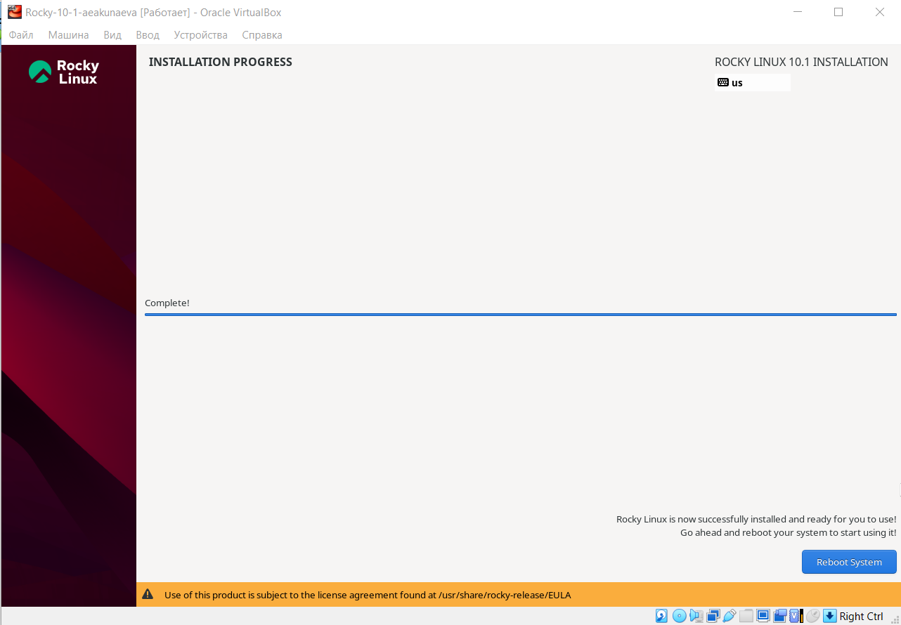
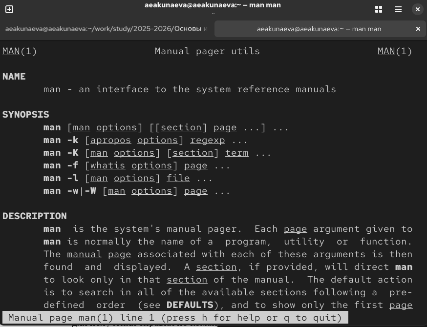
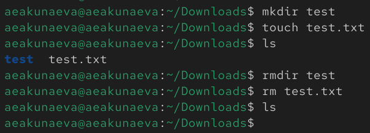

---
## Front matter
title: "Отчёт по лабораторной работе №1"
subtitle: "Установка и конфигурация операционной системы на виртуальную машину"
author: "Акунаева Антонина Эрдниевна"

## Generic otions
lang: ru-RU
toc-title: "Содержание"

## Bibliography
bibliography: bib/cite.bib
csl: pandoc/csl/gost-r-7-0-5-2008-numeric.csl

## Pdf output format
toc: true # Table of contents
toc-depth: 2
lof: true # List of figures
lot: true # List of tables
fontsize: 12pt
linestretch: 1.5
papersize: a4
documentclass: scrreprt
## I18n polyglossia
polyglossia-lang:
  name: russian
  options:
	- spelling=modern
	- babelshorthands=true
polyglossia-otherlangs:
  name: english
## I18n babel
babel-lang: russian
babel-otherlangs: english
## Fonts
mainfont: IBM Plex Serif
romanfont: IBM Plex Serif
sansfont: IBM Plex Sans
monofont: IBM Plex Mono
mathfont: STIX Two Math
mainfontoptions: Ligatures=Common,Ligatures=TeX,Scale=0.94
romanfontoptions: Ligatures=Common,Ligatures=TeX,Scale=0.94
sansfontoptions: Ligatures=Common,Ligatures=TeX,Scale=MatchLowercase,Scale=0.94
monofontoptions: Scale=MatchLowercase,Scale=0.94,FakeStretch=0.9
mathfontoptions:
## Biblatex
biblatex: true
biblio-style: "gost-numeric"
biblatexoptions:
  - parentracker=true
  - backend=biber
  - hyperref=auto
  - language=auto
  - autolang=other*
  - citestyle=gost-numeric
## Pandoc-crossref LaTeX customization
figureTitle: "Рис."
tableTitle: "Таблица"
listingTitle: "Листинг"
lofTitle: "Список иллюстраций"
lotTitle: "Список таблиц"
lolTitle: "Листинги"
## Misc options
indent: true
header-includes:
  - \usepackage{indentfirst}
  - \usepackage{float} # keep figures where there are in the text
  - \floatplacement{figure}{H} # keep figures where there are in the text
---

# Цель работы

- Целью данной работы является приобретение практических навыков установки операционной системы на виртуальную машину, настройки минимально необходимых для дальнейшей работы сервисов. [@TUIS-lab1]

# Задание

- Установить дистрибутив Rocky 10.1 на виртуальную машину.

# Выполнение лабораторной работы

Создаём виртуальную машину. Зададим название (Rocky-10-1-aeakunaeva) и выберем каталог дял установки, обозначим расположение образа диска. УБерём автоматическую установку, чтобы самостоятельно настроить систему ([рис. @fig:001]):

{#fig:001 width=65%}

Поставим необходимое нам количество памяти (от 2048 МБ) и ЦПУ ([рис. @fig:002]):

{#fig:002 width=65%}

Создаём новый виртуальный жёсткий диск и ставим не менее 40 ГБ памяти, VDI ([рис. @fig:003]):

{#fig:003 width=65%}

Запускаем виртуальную машину. Оптический диск отключается самостоятельно. В появившемся окне выбираем по умолчанию английский язык (English (US)) и нажимаем *Продолжить* ([рис. @fig:004]):

{#fig:004 width=65%}

Продолжаем настройку. В *Software selection* выбираем *Server with GUI* и в дополнительном списке находим и отмечаем *Development Tools* ([рис. @fig:005]):

{#fig:005 width=65%}

В *Network & Host Name* включаем подключение к сети (автоматически было включено) и задаём имя хоста aeakunaeva.localdomain ([рис. @fig:006]):

{#fig:006 width=65%}

В секции создания пользователя задаём наше имя aeakunaeva и указываем пароль (дополнительно отмечаем, что мы администратор), аналогично повторяем с root-пользователем ([рис. @fig:007]):

{#fig:007 width=65%}

Теперь, когда всё настроено, начинаем установку ([рис. @fig:008]):

{#fig:008 width=65%}

Дожидаемся окончания загрузки ОС ([рис. @fig:009]):

{#fig:009 width=65%}

Как только установка завершается, перезапускаем систему и входим под нашей учётной записью. Нажимаем на виртуальной машине на *Устройства* и выбираем *Подключить образ Дополнений гостевой ОС*. Устанавливаем ([рис. @fig:010]):

{#fig:010 width=65%}

# Домашнее задание

Пропишем в терминале команду ([рис. @fig:011]):

```
dmesg | less
```

Команда позволит просмотреть сообщения ядра системы, а параметр less отобразит их в одной странице.

{#fig:011 width=65%}

1. Теперь, используя команду:

```
dmesg | grep -i "то, что ищем"
```

Найдем версию ядра Linux ([рис. @fig:012]):

```
dmesg | grep -i "version"
```

{#fig:012 width=65%}

2-3. Найдём частоту и модель процессора ([рис. @fig:013]):

```
dmesg | grep -i "processor"
```

{#fig:013 width=65%}

4. Найдём объём доступной оперативной памяти ([рис. @fig:014]-[рис. @fig:015]):

```
dmesg | grep -i "memory"
```

{#fig:014 width=65%}

{#fig:015 width=65%}

5. Тип обнаруженного гипервизора ([рис. @fig:016]):

```
dmesg | grep -i "hypervisor"
```

{#fig:016 width=65%}

6-7. Тип файлоовой системы корневого раздела и последователь монтирования этой системы ([рис. @fig:017]):

```
dmesg | grep -i "filesystem"
```

{#fig:017 width=65%}

# Контрольные вопросы

**1. Какую информацию содержит учётная запись пользователя?**

Учётная запись пользователя содержит имя пользователя, пароль, UID, персональные настройки учётной записи.

**2. Укажите команды терминала и приведите примеры:**

– для получения справки по команде;

```
man [команда]
```
([рис. @fig:018])

{#fig:018 width=65%}

– для перемещения по файловой системе;

```
cd [путь]
```
([рис. @fig:019])

{#fig:019 width=65%}

– для просмотра содержимого каталога;

```
ls [опции]
```
([рис. @fig:020])

{#fig:020 width=65%}

– для определения объёма каталога;

```
du [-c/-sh] [путь]
```
([рис. @fig:021])

{#fig:021 width=65%}

– для создания / удаления каталогов / файлов;

```
mkdir [название каталога] / rm(dir) (-p) [название каталога/файла] / touch [название файла]
```
([рис. @fig:022])

{#fig:022 width=65%}

– для задания определённых прав на файл / каталог;

```
chmod [тип прав] [путь до файла/каталога]
```
([рис. @fig:023])

{#fig:023 width=65%}

– для просмотра истории команд.

```
history
```
([рис. @fig:024])

{#fig:024 width=65%}

**3. Что такое файловая система? Приведите примеры с краткой характеристикой.**

Файловой системой называется метод организации, хранения и управления данными (файлы и каталоги) на некотором носителе (в нашем случае виртуальный жёсткий диск), например ([рис. @fig:025]):

- FAT32 для Windows и Linux с ограничением размеров файлов до 4ГБ;  
- ext4 для Linux, поддерживает большие файлы и достаточно оптимизирована;  
- XFS для Linux, 64-битная система, используется в этой виртуальной машине;  
и т.д.

{#fig:025 width=65%}

**4. Как посмотреть, какие файловые системы подмонтированы в ОС?**

```
gmesg | grep -i 'filesystem'
```

**5. Как удалить зависший процесс?**

```
kill PID
```

или для жёсткого выключения

```
kill -9 PID
```

# Выводы

Я приобрела практические навыки установки операционной системы на виртуальную машину, настройки минимально необходимых для дальнейшей работы сервисов.

# Список литературы{.unnumbered}

::: {#refs}
:::
