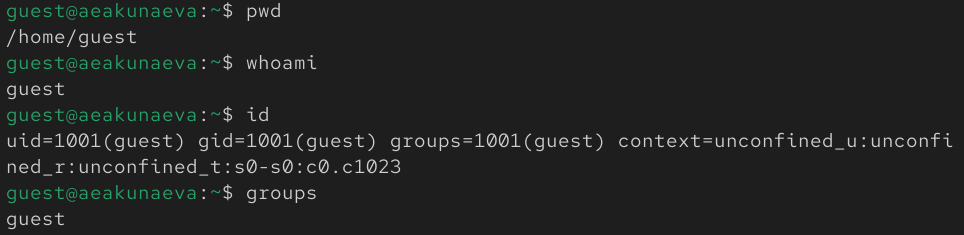
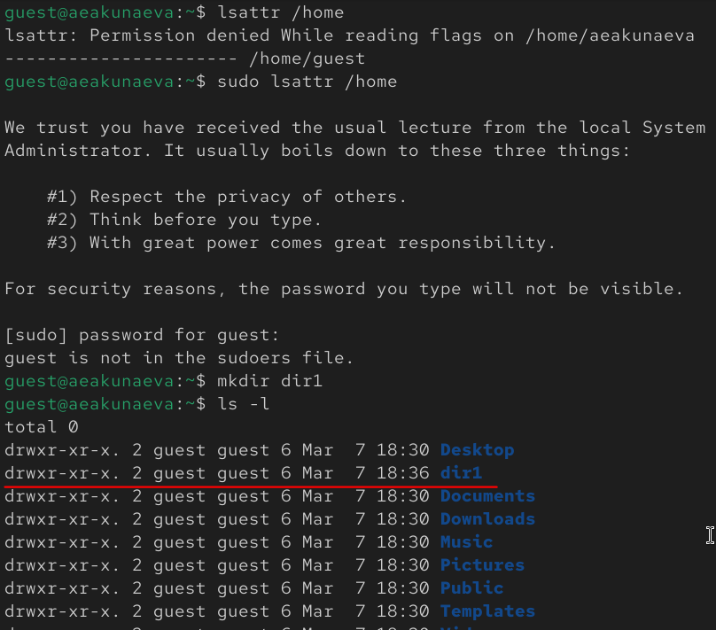

---
## Front matter
lang: ru-RU
title: Лабораторная работа №2
subtitle: Дискреционное разграничение прав в Linux. Основные атрибуты
author:
  - Акунаева Антонина Эрдниевна
institute:
  - Российский университет дружбы народов, Москва, Россия
  
date: 2025-03-07

## i18n babel
babel-lang: russian
babel-otherlangs: english

## Formatting pdf
toc: false
toc-title: Содержание
slide_level: 2
aspectratio: 169
section-titles: true
theme: metropolis
header-includes:
 - \metroset{progressbar=frametitle,sectionpage=progressbar,numbering=fraction}
---

# Информация

## Докладчик

:::::::::::::: {.columns align=center}
::: {.column width="70%"}

  * Акунаева Антонина Эрдниевна
  * студент ФФМиЕН, НПИбд-01-24
  * Российский университет дружбы народов
  * [1032240492@rudn.ru](mailto:1032240492@rudn.ru)
  * <https://github.com/axelxi>

:::
::: {.column width="30%"}


:::
::::::::::::::

# Цели и задачи

- Получение практических навыков работы в консоли с атрибутами файлов, закрепление теоретических основ дискреционного разграничения доступа в современных системах с открытым кодом на базе ОС Linux.

1. Ознакомиться с командами проверки и управления атрибутами файлов, учётной записи в Linux.  
2. Заполнить таблицы.

# Материалы и методы

- Linux (дистрибутив Rocky 10.1)
- Oracle VirtualBox

# Выполнение лабораторной работы

## Создание учётной записи guest

```
useradd guest
passwd guest
```

{#fig:001 width=65%}

## Вход в учётную запись guest

{#fig:002 width=65%}

## Проверка данных учётной записи guest

{#fig:003 width=65%}

## Данные о поддиректориях /home

{#fig:004 width=65%}

## Данные о поддиректориях /home

{#fig:005 width=65%}

## Управление атрибутами директорий

{#fig:006 width=65%}

# Таблицы

## Таблица 2.1. Установленные права и разрешённые действия

| Права директории | Права файла | Создание файла | Удаление файла | Запись в файл | Чтение файла | Смена директории | Просмотр файлов в директории | Переименование файла | Смена атрибутов файла |
|----|---|----|---|----|--|--|---|---|----|
| d (000) | (000) | - | - | - | - | - | - | - | - |
| d--x------ (100) | ---x------ (100) | - | - | - | - | + | - | - | + |
| dr-------- (400) | -r-------- (400) | - | - | - | + | - | + | - | - |
| d-w------- (200) | --w------- (200) | + | + | + | - | - | - | + | - |
| dr-x------ (500) | -r-x------ (500) | - | - | - | + | + | + | - | + |
| drw------- (600) | -rw------- (600) | + | + | + | + | - | + | + | - |
| d-wx------ (300) | --wx------ (300) | + | + | + | - | + | - | + | + |
| drwx------ (700) | -rwx------ (700) | + | + | + | + | + | + | + | + |

## Таблица 2.2. Минимальные права для совершения операций

| Операция | Минимальные права на директорию | Минимальные права на файл |
| -------------|------------|-------------- |
| Создание файла | d-w------- | --w------- |
| Удаление файла | d-w------- | --w------- |
| Чтение файла | dr-------- | -r-------- |
| Запись в файл | d-w------- | --w------- |
| Переименовывание файла | d-w------- | --w------- |
| Создание поддиректории | d-w------- | ---------- |
| Удаление поддиректории | d-w------- | -------- |

# Выводы

Я получила практических навыков работы в консоли с атрибутами файлов, закрепление теоретических основ дискреционного разграничения доступа в современных системах с открытым кодом на базе ОС Linux.
