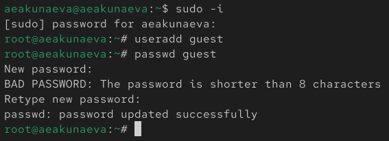
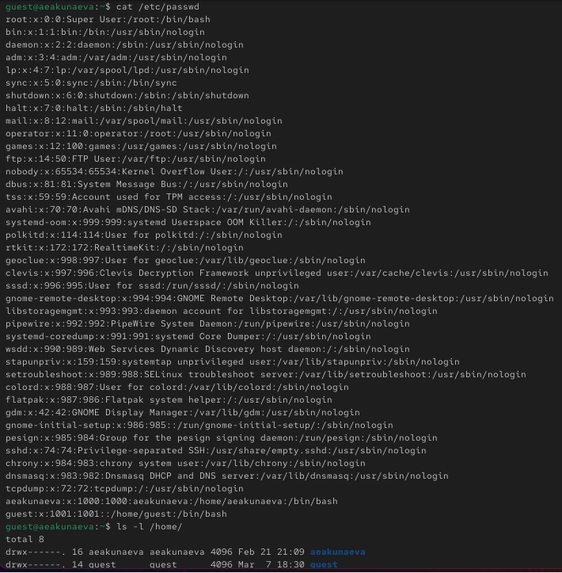
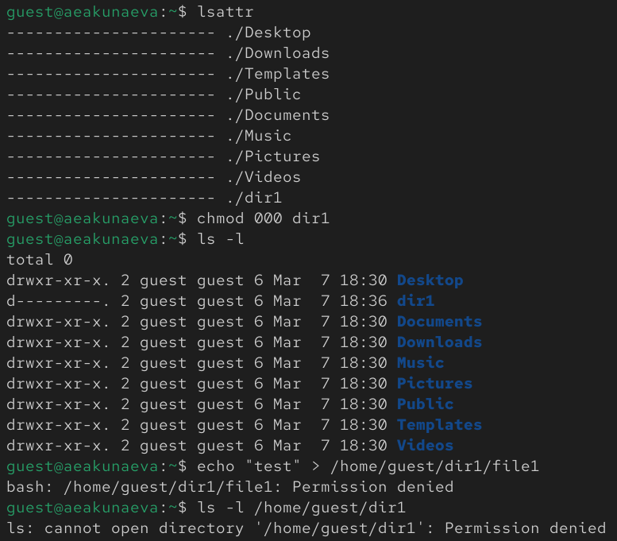

---
## Front matter
title: "Отчёт по лабораторной работе №2"
subtitle: "Дискреционное разграничение прав в Linux. Основные атрибуты"
author: "Акунаева Антонина Эрдниевна"

## Generic otions
lang: ru-RU
toc-title: "Содержание"

## Bibliography
bibliography: bib/cite.bib
csl: pandoc/csl/gost-r-7-0-5-2008-numeric.csl

## Pdf output format
toc: true # Table of contents
toc-depth: 2
lof: true # List of figures
lot: true # List of tables
fontsize: 12pt
linestretch: 1.5
papersize: a4
documentclass: scrreprt
## I18n polyglossia
polyglossia-lang:
  name: russian
  options:
	- spelling=modern
	- babelshorthands=true
polyglossia-otherlangs:
  name: english
## I18n babel
babel-lang: russian
babel-otherlangs: english
## Fonts
mainfont: IBM Plex Serif
romanfont: IBM Plex Serif
sansfont: IBM Plex Sans
monofont: IBM Plex Mono
mathfont: STIX Two Math
mainfontoptions: Ligatures=Common,Ligatures=TeX,Scale=0.94
romanfontoptions: Ligatures=Common,Ligatures=TeX,Scale=0.94
sansfontoptions: Ligatures=Common,Ligatures=TeX,Scale=MatchLowercase,Scale=0.94
monofontoptions: Scale=MatchLowercase,Scale=0.94,FakeStretch=0.9
mathfontoptions:
## Biblatex
biblatex: true
biblio-style: "gost-numeric"
biblatexoptions:
  - parentracker=true
  - backend=biber
  - hyperref=auto
  - language=auto
  - autolang=other*
  - citestyle=gost-numeric
## Pandoc-crossref LaTeX customization
figureTitle: "Рис."
tableTitle: "Таблица"
listingTitle: "Листинг"
lofTitle: "Список иллюстраций"
lotTitle: "Список таблиц"
lolTitle: "Листинги"
## Misc options
indent: true
header-includes:
  - \usepackage{indentfirst}
  - \usepackage{float} # keep figures where there are in the text
  - \floatplacement{figure}{H} # keep figures where there are in the text
---

# Цель работы

- Получение практических навыков работы в консоли с атрибутами файлов, закрепление теоретических основ дискреционного разграничения доступа в современных системах с открытым кодом на базе ОС Linux. [@TUIS-lab2]

# Задание

- Ознакомиться с командами проверки и управления атрибутами файлов, учётной записи в Linux.  
- Заполнить таблицы.

# Выполнение лабораторной работы

В нашей системе aeakunaeva в терминале создаём нового пользователя guest (также заходим как администратор и вводим пароль от учётной записи) ([рис. @fig:001]):

```
sudo -i
useradd guest
```

Задаём пароль для новой учётной записи guest, при необходимости вводим его дважды:

```
passwd guest
```

{#fig:001 width=65%}

Перезаходим в учётную запись, но теперь в guest (можно через Log out или Switch user). Вводим ранее заданный пароль ([рис. @fig:002]):

{#fig:002 width=65%}

В терминале учётной записи guest вводим команду для проверки текущей директории ([рис. @fig:003]):

```
pwd
```

Результат обозначает, что мы находимся в домашней директории пользователя guest (*/home/guest*), что совпадает с приглашением командной строки ~ (домашняя директория).

Затем уточним имя пользователя:

```
whoami
```

Команда выведет *guest*, что совпадает с действительностью. После используем команду для вывода информации об uid, группах пользователя:

```
id
```

Результат покажет, что пользователь guest имеет uid = 1001 и соответствующие ему группы guest (1001). Если введём команду для вывода в терминал информации о группах пользователя, то получим также удовлетворяющий действительности ответ (что пользователь guest входит в группы guest):

```
groups
```

Все выведенные из команд выше данные совпадают с заданной по умолчанию информацией о пользователе guest.

{#fig:003 width=65%}

Просмотрим содержимое файла */etc/passwd*, выведя его на экран ([рис. @fig:004]):

```
cat /etc/passwd
```

Получим несколько строк с информацией о паролях и прочей конфеденциальной информации о системе и пользователях, в том числе о наших основном и допонлительном аккаунтах: aeakunaeva и guest. В самом конце найдём запись о пользователе guest. Информация о uid и группе (с номерами 1001) совпадает с ранее полученными данными).

Определим существующие в системе директории:

```
ls -l /home/
```

Мы смогли получить список поддиректорий /home: всего их две для пользователей aeakunaeva и guest. Для обеих директорий установлены права на чтение, запись и исполнение для владельца и отсутствуют для остальных (drwx------).

{#fig:004 width=65%}

Проверим установленные расширенные атрибуты для поддиректорий /home ([рис. @fig:005]):

```
lsattr /home
```

Нам не позволяют просмотреть их без входа как root-пользователь, поэтому добавляем sudo и вводим пароль:

```
sudo lsattr /home
```

Однако мы всё равно не можем получить доступ к этой информации, т.к. guest не является администратором, в отличие от aeakunaeva.

Тогда создадим каталог dir1 в домашней директории:

```
mkdir dir1
```

И проверим его данные о правах:

```
ls -l
```
Для владельца доступно всё, в то время как для остальных только чтение и исполнение без записи (drwxr-xr-x).

{#fig:005 width=65%}

Проверим теперь список атрибутов для dir1 ([рис. @fig:006]):

```
lsattr
```

В списке находим каталог dir1. Теперь снимаем все атрибуты с dir1:

```
chmod 000 dir1
```

И проверяем:

```
ls -l
```

Теперь для каталога dir1 не существует прав ни для какой группы пользователей. Если мы попытаемся создать файл file1 в директории dir1, то получим сообщение об отказе в доступе, потому что ранее мы сняли все атрибуты (права) с каталога dir1 для всех групп. Если мы попробуем проверить наличие файла file1, то также получим отказ в доступе:

```
echo "test" > /home/guest/dir1/file1
ls -l /home/guest/dir1
```

{#fig:006 width=65%}

# Таблицы

## Таблица 2.1. Установленные права и разрешённые действия

| Права директории | Права файла | Создание файла | Удаление файла | Запись в файл | Чтение файла | Смена директории | Просмотр файлов в директории | Переименование файла | Смена атрибутов файла |
|----|---|---|---|--|--|--|---|----|----|
| d (000) | (000) | - | - | - | - | - | - | - | - |
| d--x------ (100) | ---x------ (100) | - | - | - | - | + | - | - | + |
| dr-------- (400) | -r-------- (400) | - | - | - | + | - | + | - | - |
| d-w------- (200) | --w------- (200) | + | + | + | - | - | - | + | - |
| dr-x------ (500) | -r-x------ (500) | - | - | - | + | + | + | - | + |
| drw------- (600) | -rw------- (600) | + | + | + | + | - | + | + | - |
| d-wx------ (300) | --wx------ (300) | + | + | + | - | + | - | + | + |
| drwx------ (700) | -rwx------ (700) | + | + | + | + | + | + | + | + |

## Таблица 2.2. Минимальные права для совершения операций

| Операция | Минимальные права на директорию | Минимальные права на файл |
| -----------------|-----------|---------- |
| Создание файла | d-w------- | --w------- |
| Удаление файла | d-w------- | --w------- |
| Чтение файла | dr-------- | -r-------- |
| Запись в файл | d-w------- | --w------- |
| Переименовывание файла | d-w------- | --w------- |
| Создание поддиректории | d-w------- | ---------- |
| Удаление поддиректории | d-w------- | -------- |

# Выводы

Я получила практических навыков работы в консоли с атрибутами файлов, закрепление теоретических основ дискреционного разграничения доступа в современных системах с открытым кодом на базе ОС Linux.

# Список литературы{.unnumbered}

::: {#refs}
:::
